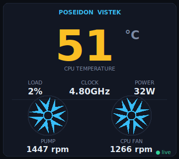

# Poseidon Vistek LCD — Linux driver

> 🌐 **Website:** https://AbhishekYadav28091987.github.io/poseidon-vistek-linux
> 💜 **Donate (UPI):** `9450909077@upi` · 🛠️ **Custom Linux driver/software:** 📞 `9898327666`

Linux userspace driver for the **COUGAR Poseidon Vistek ARGB** 1.9" AIO cooler
display (the pump-head screen). The screen enumerates as USB HID
**`2c65:1000` "HWCX USB Display"**. There is no Windows kernel driver — the
vendor "Digital Display Driver" (`RM-Hardware`) is a userspace app that pushes
HID reports to the screen. This project reimplements that on Linux.

The cooler block (with the two coolant tubes) sits on the CPU; the screen does
**not** measure temperature itself — the host reads sensors and pushes the
values, and the screen's firmware renders them.

<p align="center">
  
  <br><i>The desktop widget: live CPU temp, power, and both fan speeds with animated fans.</i>
</p>

## What it shows

CPU temperature, CPU load %, CPU clock, CPU power (W), and one fan/pump RPM.
Values are read from Linux sensors:

| Field    | Linux source                                    |
|----------|-------------------------------------------------|
| CPU temp | `k10temp` (Tctl)                                |
| CPU load | `/proc/stat`                                    |
| CPU clock| `/proc/cpuinfo`                                 |
| CPU watt | RAPL `intel-rapl:0` package energy (needs root) |
| Fan RPM  | `nct6687` Super-I/O chip (loaded in force mode) |

## Install

Download the packages from the [**latest release**](https://github.com/AbhishekYadav28091987/poseidon-vistek-linux/releases/latest).

### Debian / Ubuntu / Mint / Pop!_OS (.deb)

```bash
wget https://github.com/AbhishekYadav28091987/poseidon-vistek-linux/releases/download/v1.0.0/vistek-display_1.0.0_all.deb
sudo apt install ./vistek-display_1.0.0_all.deb
```

### Any other distro (tarball)

```bash
wget https://github.com/AbhishekYadav28091987/poseidon-vistek-linux/releases/download/v1.0.0/vistek-display-1.0.0.tar.gz
tar xzf vistek-display-1.0.0.tar.gz
cd vistek-display-1.0.0 && sudo ./install.sh
```

### From source (this repo)

```bash
sudo ./install.sh
```

All three install the same thing: the `vistek` driver + `vistek-widget` GUI,
auto-load the `nct6687` fan sensor at boot, a udev rule, and a systemd service
that streams to the screen at 2 Hz (the panel powers off if not fed
continuously). The desktop widget is added to your app menu and auto-starts on
login.

```bash
systemctl status vistek-display      # the screen service
journalctl -u vistek-display -f      # logs
vistek-widget                        # launch the desktop widget manually
```

Rebuild the packages with `packaging/build.sh` (outputs to `dist/`).

## Desktop widget

`vistek-widget` is a small always-on-top panel mirroring the cooler's LCD: CPU
temperature, load, clock and power, **both** fan speeds with animated fans that
spin at a rate proportional to their real RPM, and the pump speed. It reads the
daemon's status file (`/run/vistek/status.json`), so it needs no root. Drag to
move; right-click for a menu (always-on-top, reset position, quit). Launch it
from the app menu ("Poseidon Vistek Monitor") or the `vistek-widget` command.

### Configuration — `/etc/default/vistek-display`

```ini
VISTEK_INTERVAL=0.5   # seconds between updates (panel needs a steady feed)
VISTEK_FAN_CH=16      # nct6687 fan channel shown as the LCD's RPM value
VISTEK_PUMP_CH=1      # secondary channel (not shown on the 1.9" model)
VISTEK_WAIT=1         # wait for the USB display at startup
```

The 1.9" panel has **one** RPM field. This board exposes two live channels —
`fan16` (~1230) and `fan1` (~1460). `VISTEK_FAN_CH` selects which one is shown.
Run `vistek.py fans` to list channels; spin the pump/fans up to tell them apart.
After editing: `sudo systemctl restart vistek-display`.

## Manual use

```bash
sudo ./vistek.py test 77     # send a fixed 77 C (verify the screen)
sudo ./vistek.py once        # one real update
sudo ./vistek.py daemon      # stream (what the service runs)
sudo ./vistek.py fans        # list nct6687 fan channels
./vistek.py raw 02 4d ...    # send raw payload bytes (debug)
```

## Uninstall

```bash
sudo ./uninstall.sh
```

---

## Protocol (reverse-engineered from `TempComm.dll` + `XKWLib.dll`)

- HID interface, **interrupt OUT EP `0x03`**, IN EP `0x81`, 64-byte reports,
  no report ID. Linux write = `[0x00 report-id] + 64 payload bytes` (65 total).
- Device matched by VID/PID `2c65:1000`.
- The panel has a **watchdog**: a single packet does nothing; it only powers on
  while fed continuously (Windows feeds at 2 Hz).

### Command `0x02` — dynamic monitoring (the only packet needed)

Payload byte offsets (payload[0] = `0x02`; on the wire these are HID report
bytes, i.e. report[n] = payload[n-1] because of the leading report-id):

| payload | field                          | encoding            |
|---------|--------------------------------|---------------------|
| 0       | command                        | `0x02`              |
| 1       | CPU temperature                | °C                  |
| 3..6    | hour, minute, second, ms/10    |                     |
| 7..11   | century(20), year%100, month, day, weekday | clock    |
| 12      | CPU load                       | %                   |
| 13,14   | CPU clock                      | MHz, big-endian 16  |
| 0x18,0x19 | CPU/radiator fan RPM (shown) | big-endian 16       |
| 0x1a,0x1b | CPU voltage                  | volts, hundredths   |
| 0x1c,0x1d | CPU power                    | W×10, big-endian 16 |
| 0x31,0x32 | water-pump RPM               | big-endian 16       |
| 0x30      | display mode                 | byte (unused = 0)   |

Other commands exist but are not needed: `0x05` = RGB color (`SetColor`).
Name setters (`SetCpuName`, …) are no-ops in the firmware.

### Files in this repo
- `vistek.py` — the driver/daemon
- `vistek_widget.py` — the desktop widget (animated fans)
- `install.sh` / `uninstall.sh` — source install
- `packaging/build.sh` — builds the `.deb` and `.tar.gz`
- `analyze.py` — the static-analysis helper used to reverse the protocol
- `docs/index.html` — the project website (GitHub Pages)

Vendor binaries and decompiled code are intentionally **not** included.

## Support this project

If this saved you from dual-booting Windows, consider supporting development:

- 💜 **Donate via UPI:** `9450909077@upi` (GPay / PhonePe / Paytm)
- 🛠️ **Need a custom Linux driver or software?** Call / WhatsApp **9898327666**

## Disclaimer

Independent, interoperability-focused project — **not** affiliated with or endorsed
by COUGAR / PCCOOLER. No vendor software, binaries, or decompiled code are distributed
here. Trademarks belong to their respective owners. Use at your own risk.
